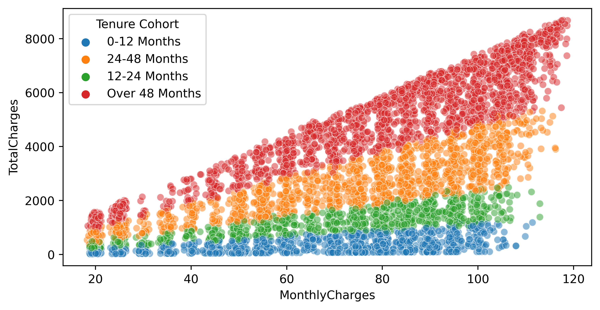
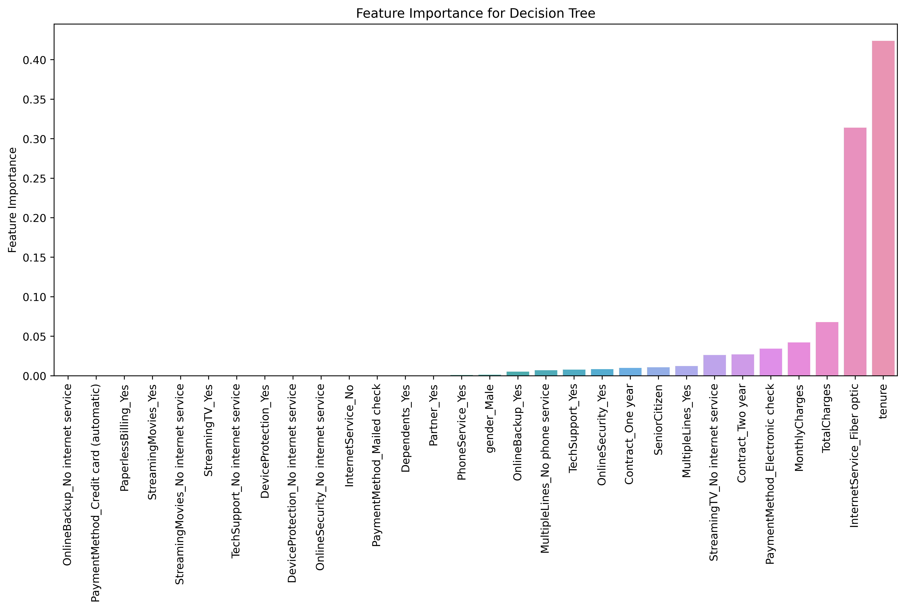

# Telecom_Churn_Analysis
This project focuses on segmenting customers based on their tenure, creating "cohorts", allowing us to examine differences between customer cohort segments and determine the best tree based ML model.

